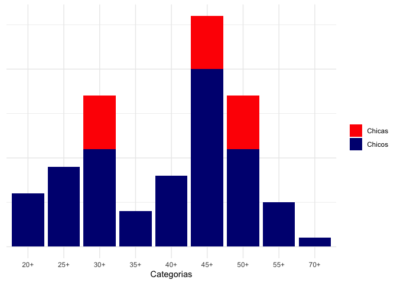
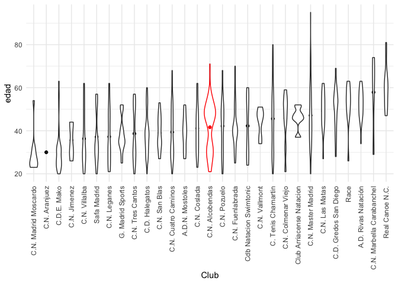
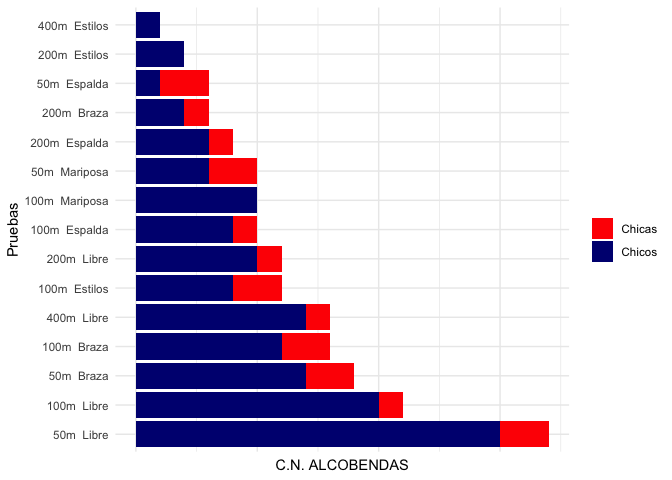
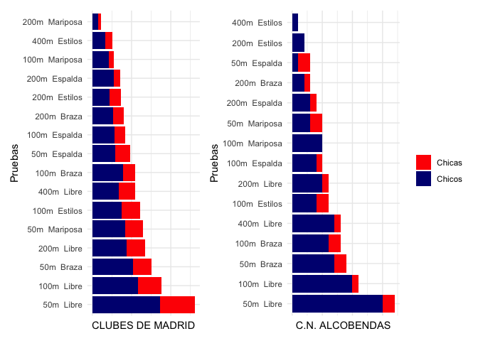
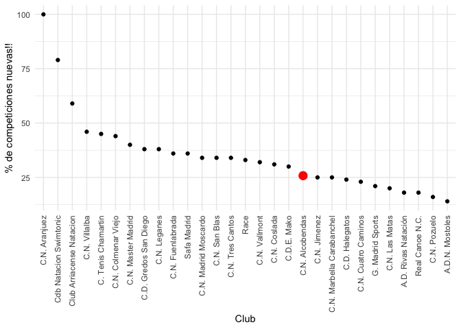

# C.N. ALCOBENDAS 

<br>
<br>
<br>

##   <span style="color:orange"> QUIENES SOMOS? </span>


<br>
<br>


```{=html}
<div id="htmlwidget-58d03d533eaaa552196c" style="width:672px;height:480px;" class="wordcloud2 html-widget"></div>
<script type="application/json" data-for="htmlwidget-58d03d533eaaa552196c">{"x":{"word":["C.N. ALCOBENDAS"," Alicia"," Javier"," Ignacio"," David"," Andres"," Diego"," Elena"," Juan Antonio"," Pablo"," Carlos"," Diego"," Angel"," Jose A."," Enrique"," Hector"," Laura"," Gabriela"," Israel"," Jesus"," Abel"," Raquel"," Vasco Jorge"," Carlos"," Carlos A."," Diego"," Edmundo"," Adrian"," Alberto Manuel"," Cesar"," Oscar"," Jorge"," Alejandro"," Niall"," Daniel"," Elena"],"freq":[2,1,1,1,1,1,1,1,1,1,1,1,1,1,1,1,1,1,1,1,1,1,1,1,1,1,1,1,1,1,1,1,1,1,1,1],"fontFamily":"Segoe UI","fontWeight":"bold","color":"random-dark","minSize":0,"weightFactor":27,"backgroundColor":"white","gridSize":0,"minRotation":-0.785398163397448,"maxRotation":0.785398163397448,"shuffle":true,"rotateRatio":0.4,"shape":"circle","ellipticity":0.65,"figBase64":null,"hover":null},"evals":[],"jsHooks":{"render":[{"code":"function(el,x){\n                        console.log(123);\n                        if(!iii){\n                          window.location.reload();\n                          iii = False;\n\n                        }\n  }","data":null}]}}</script>
```


<br>
<br>
<br>
<br>

## Vamos a nadar <span style="color:orange"> 93 pruebas </span> individuales y <span style="color:orange"> 11.8 kilómetros </span> !!!

<br>
<br>

<!-- -->

<br>
<br>
<br>

## somos un equipo super balanceado por edades.....

<br>
<br>

<!-- -->

<br>
<br>
<br>


## y nadaremos en <span style="color: orange"> 15!! pruebas diferentes!! </span>

<br>
<br>

<!-- -->

<br>
<br>

## el top 3 de nuestras carreras son muy madrileñas!!
### <span style="color: orange;"> Somos una comunidad de velocístas!!</span>

<br>
<br>

<!-- -->

<br>
<br>

## Listos para enfrentar nuevos retos...

<br>


<br>
<br>

### el 26%  de nuestras pruebas .. estamos inscritos con N:T. hace mas de 3 años que no las nadamos... SIEMPRE BUSCANDO NUEVOS RETOS!!! 

Este gráfico muestra la proporción de pruebas por equipo en las que estamos inscritos con NT.

<br>
<br>

<!-- -->

<br>
<br>

# y como vienen <span style="color: orange">los pronósticos??</span>

con los tiempos de inscripción, el top ten por clubes ( por puntos )

<br>


```r
## puntos pesado por numero de nadadores

# los_datos %>% 
#   group_by(Club) %>% 
#   mutate(total_nadadores = length(unique(Nombre))) %>% 
#   filter(Tiempo != "NT") %>% 
#   group_by(cat,Prueba, estilo,Sexo) %>% 
#   mutate(id=row_number(),
#          puntos = 9-id,
#          puntos = ifelse(id == 1, puntos +1, puntos)
#          ) %>% 
#   ungroup() %>% 
#   group_by(Club) %>% 
#   summarise(ranking = sum(puntos)/first(total_nadadores)) %>%
#   arrange(desc(ranking)) %>% 
#   select(Club) %>% 
#   # head(13) %>% 
#   flextable() %>% 
#   autofit()
```


```{=html}
<template id="743c8ec7-3ae8-424f-b021-9ddad51a81cc"><style>
.tabwid table{
  border-spacing:0px !important;
  border-collapse:collapse;
  line-height:1;
  margin-left:auto;
  margin-right:auto;
  border-width: 0;
  display: table;
  margin-top: 1.275em;
  margin-bottom: 1.275em;
  border-color: transparent;
}
.tabwid_left table{
  margin-left:0;
}
.tabwid_right table{
  margin-right:0;
}
.tabwid td {
    padding: 0;
}
.tabwid a {
  text-decoration: none;
}
.tabwid thead {
    background-color: transparent;
}
.tabwid tfoot {
    background-color: transparent;
}
.tabwid table tr {
background-color: transparent;
}
</style><div class="tabwid"><style>.cl-9e7b3924{}.cl-9e6b699a{font-family:'Helvetica';font-size:11pt;font-weight:normal;font-style:normal;text-decoration:none;color:rgba(0, 0, 0, 1.00);background-color:transparent;}.cl-9e6b99b0{margin:0;text-align:left;border-bottom: 0 solid rgba(0, 0, 0, 1.00);border-top: 0 solid rgba(0, 0, 0, 1.00);border-left: 0 solid rgba(0, 0, 0, 1.00);border-right: 0 solid rgba(0, 0, 0, 1.00);padding-bottom:5pt;padding-top:5pt;padding-left:5pt;padding-right:5pt;line-height: 1;background-color:transparent;}.cl-9e6bf55e{width:125.1pt;background-color:transparent;vertical-align: middle;border-bottom: 0 solid rgba(0, 0, 0, 1.00);border-top: 0 solid rgba(0, 0, 0, 1.00);border-left: 0 solid rgba(0, 0, 0, 1.00);border-right: 0 solid rgba(0, 0, 0, 1.00);margin-bottom:0;margin-top:0;margin-left:0;margin-right:0;}.cl-9e6bf572{width:125.1pt;background-color:transparent;vertical-align: middle;border-bottom: 2pt solid rgba(102, 102, 102, 1.00);border-top: 0 solid rgba(0, 0, 0, 1.00);border-left: 0 solid rgba(0, 0, 0, 1.00);border-right: 0 solid rgba(0, 0, 0, 1.00);margin-bottom:0;margin-top:0;margin-left:0;margin-right:0;}.cl-9e6bf573{width:125.1pt;background-color:transparent;vertical-align: middle;border-bottom: 0 solid rgba(0, 0, 0, 1.00);border-top: 0 solid rgba(0, 0, 0, 1.00);border-left: 0 solid rgba(0, 0, 0, 1.00);border-right: 0 solid rgba(0, 0, 0, 1.00);margin-bottom:0;margin-top:0;margin-left:0;margin-right:0;}.cl-9e6bf57c{width:125.1pt;background-color:transparent;vertical-align: middle;border-bottom: 0 solid rgba(0, 0, 0, 1.00);border-top: 0 solid rgba(0, 0, 0, 1.00);border-left: 0 solid rgba(0, 0, 0, 1.00);border-right: 0 solid rgba(0, 0, 0, 1.00);margin-bottom:0;margin-top:0;margin-left:0;margin-right:0;}.cl-9e6bf586{width:125.1pt;background-color:transparent;vertical-align: middle;border-bottom: 0 solid rgba(0, 0, 0, 1.00);border-top: 0 solid rgba(0, 0, 0, 1.00);border-left: 0 solid rgba(0, 0, 0, 1.00);border-right: 0 solid rgba(0, 0, 0, 1.00);margin-bottom:0;margin-top:0;margin-left:0;margin-right:0;}.cl-9e6bf590{width:125.1pt;background-color:transparent;vertical-align: middle;border-bottom: 2pt solid rgba(102, 102, 102, 1.00);border-top: 2pt solid rgba(102, 102, 102, 1.00);border-left: 0 solid rgba(0, 0, 0, 1.00);border-right: 0 solid rgba(0, 0, 0, 1.00);margin-bottom:0;margin-top:0;margin-left:0;margin-right:0;}</style><table class='cl-9e7b3924'>
```

```{=html}
<thead><tr style="overflow-wrap:break-word;"><td class="cl-9e6bf590"><p class="cl-9e6b99b0"><span class="cl-9e6b699a">Club</span></p></td></tr></thead><tbody><tr style="overflow-wrap:break-word;"><td class="cl-9e6bf55e"><p class="cl-9e6b99b0"><span class="cl-9e6b699a">C.N. Master Madrid</span></p></td></tr><tr style="overflow-wrap:break-word;"><td class="cl-9e6bf55e"><p class="cl-9e6b99b0"><span class="cl-9e6b699a">C.N. Cuatro Caminos</span></p></td></tr><tr style="overflow-wrap:break-word;"><td class="cl-9e6bf573"><p class="cl-9e6b99b0"><span class="cl-9e6b699a">C.D. Halegatos</span></p></td></tr><tr style="overflow-wrap:break-word;"><td class="cl-9e6bf55e"><p class="cl-9e6b99b0"><span class="cl-9e6b699a">C. Tenis Chamartin</span></p></td></tr><tr style="overflow-wrap:break-word;"><td class="cl-9e6bf573"><p class="cl-9e6b99b0"><span class="cl-9e6b699a">C.N. Leganes</span></p></td></tr><tr style="overflow-wrap:break-word;"><td class="cl-9e6bf57c"><p class="cl-9e6b99b0"><span class="cl-9e6b699a">C.D.E. Mako</span></p></td></tr><tr style="overflow-wrap:break-word;"><td class="cl-9e6bf586"><p class="cl-9e6b99b0"><span class="cl-9e6b699a">C.N. Fuenlabrada</span></p></td></tr><tr style="overflow-wrap:break-word;"><td class="cl-9e6bf55e"><p class="cl-9e6b99b0"><span class="cl-9e6b699a">C.N. Alcobendas</span></p></td></tr><tr style="overflow-wrap:break-word;"><td class="cl-9e6bf57c"><p class="cl-9e6b99b0"><span class="cl-9e6b699a">Real Canoe N.C.</span></p></td></tr><tr style="overflow-wrap:break-word;"><td class="cl-9e6bf572"><p class="cl-9e6b99b0"><span class="cl-9e6b699a">A.D. Rivas Natación</span></p></td></tr></tbody></table></div></template>
<div class="flextable-shadow-host" id="91ee64e4-4a30-44b9-a5d0-f486992d5757"></div>
<script>
var dest = document.getElementById("91ee64e4-4a30-44b9-a5d0-f486992d5757");
var template = document.getElementById("743c8ec7-3ae8-424f-b021-9ddad51a81cc");
var caption = template.content.querySelector("caption");
if(caption) {
  caption.style.cssText = "display:block;text-align:center;";
  var newcapt = document.createElement("p");
  newcapt.appendChild(caption)
  dest.parentNode.insertBefore(newcapt, dest.previousSibling);
}
var fantome = dest.attachShadow({mode: 'open'});
var templateContent = template.content;
fantome.appendChild(templateContent);
</script>

```

<br>
<br>

##  <span style="color: red">Y las MEDALLAS?????</span>
<br>

hay que ver como nos sale el fin a todos... y las sorpresas de los NT!!!!.. pero jugando con los tiempos de inscripción... salen un montón!!! ahora solo hay que nadar!!!
<br>

```{=html}
<template id="24765171-c07b-4f24-96ce-f1abf4b89f65"><style>
.tabwid table{
  border-spacing:0px !important;
  border-collapse:collapse;
  line-height:1;
  margin-left:auto;
  margin-right:auto;
  border-width: 0;
  display: table;
  margin-top: 1.275em;
  margin-bottom: 1.275em;
  border-color: transparent;
}
.tabwid_left table{
  margin-left:0;
}
.tabwid_right table{
  margin-right:0;
}
.tabwid td {
    padding: 0;
}
.tabwid a {
  text-decoration: none;
}
.tabwid thead {
    background-color: transparent;
}
.tabwid tfoot {
    background-color: transparent;
}
.tabwid table tr {
background-color: transparent;
}
</style><div class="tabwid"><style>.cl-9eaf3878{}.cl-9ea233bc{font-family:'Helvetica';font-size:11pt;font-weight:normal;font-style:normal;text-decoration:none;color:rgba(0, 0, 0, 1.00);background-color:transparent;}.cl-9ea25310{margin:0;text-align:left;border-bottom: 0 solid rgba(0, 0, 0, 1.00);border-top: 0 solid rgba(0, 0, 0, 1.00);border-left: 0 solid rgba(0, 0, 0, 1.00);border-right: 0 solid rgba(0, 0, 0, 1.00);padding-bottom:5pt;padding-top:5pt;padding-left:5pt;padding-right:5pt;line-height: 1;background-color:transparent;}.cl-9ea25324{margin:0;text-align:right;border-bottom: 0 solid rgba(0, 0, 0, 1.00);border-top: 0 solid rgba(0, 0, 0, 1.00);border-left: 0 solid rgba(0, 0, 0, 1.00);border-right: 0 solid rgba(0, 0, 0, 1.00);padding-bottom:5pt;padding-top:5pt;padding-left:5pt;padding-right:5pt;line-height: 1;background-color:transparent;}.cl-9ea31f70{width:54pt;background-color:transparent;vertical-align: middle;border-bottom: 0 solid rgba(0, 0, 0, 1.00);border-top: 0 solid rgba(0, 0, 0, 1.00);border-left: 0 solid rgba(0, 0, 0, 1.00);border-right: 0 solid rgba(0, 0, 0, 1.00);margin-bottom:0;margin-top:0;margin-left:0;margin-right:0;}.cl-9ea31f84{width:54pt;background-color:transparent;vertical-align: middle;border-bottom: 0 solid rgba(0, 0, 0, 1.00);border-top: 0 solid rgba(0, 0, 0, 1.00);border-left: 0 solid rgba(0, 0, 0, 1.00);border-right: 0 solid rgba(0, 0, 0, 1.00);margin-bottom:0;margin-top:0;margin-left:0;margin-right:0;}.cl-9ea31f8e{width:54pt;background-color:transparent;vertical-align: middle;border-bottom: 2pt solid rgba(102, 102, 102, 1.00);border-top: 0 solid rgba(0, 0, 0, 1.00);border-left: 0 solid rgba(0, 0, 0, 1.00);border-right: 0 solid rgba(0, 0, 0, 1.00);margin-bottom:0;margin-top:0;margin-left:0;margin-right:0;}.cl-9ea31f98{width:54pt;background-color:transparent;vertical-align: middle;border-bottom: 2pt solid rgba(102, 102, 102, 1.00);border-top: 0 solid rgba(0, 0, 0, 1.00);border-left: 0 solid rgba(0, 0, 0, 1.00);border-right: 0 solid rgba(0, 0, 0, 1.00);margin-bottom:0;margin-top:0;margin-left:0;margin-right:0;}.cl-9ea31fa2{width:54pt;background-color:transparent;vertical-align: middle;border-bottom: 2pt solid rgba(102, 102, 102, 1.00);border-top: 2pt solid rgba(102, 102, 102, 1.00);border-left: 0 solid rgba(0, 0, 0, 1.00);border-right: 0 solid rgba(0, 0, 0, 1.00);margin-bottom:0;margin-top:0;margin-left:0;margin-right:0;}.cl-9ea31fac{width:54pt;background-color:transparent;vertical-align: middle;border-bottom: 2pt solid rgba(102, 102, 102, 1.00);border-top: 2pt solid rgba(102, 102, 102, 1.00);border-left: 0 solid rgba(0, 0, 0, 1.00);border-right: 0 solid rgba(0, 0, 0, 1.00);margin-bottom:0;margin-top:0;margin-left:0;margin-right:0;}</style><table class='cl-9eaf3878'>
```

```{=html}
<thead><tr style="overflow-wrap:break-word;"><td class="cl-9ea31fa2"><p class="cl-9ea25310"><span class="cl-9ea233bc">medallas</span></p></td><td class="cl-9ea31fac"><p class="cl-9ea25324"><span class="cl-9ea233bc">n</span></p></td></tr></thead><tbody><tr style="overflow-wrap:break-word;"><td class="cl-9ea31f70"><p class="cl-9ea25310"><span class="cl-9ea233bc">ORO</span></p></td><td class="cl-9ea31f84"><p class="cl-9ea25324"><span class="cl-9ea233bc">20</span></p></td></tr><tr style="overflow-wrap:break-word;"><td class="cl-9ea31f70"><p class="cl-9ea25310"><span class="cl-9ea233bc">PLATA</span></p></td><td class="cl-9ea31f84"><p class="cl-9ea25324"><span class="cl-9ea233bc">6</span></p></td></tr><tr style="overflow-wrap:break-word;"><td class="cl-9ea31f8e"><p class="cl-9ea25310"><span class="cl-9ea233bc">BRONCE</span></p></td><td class="cl-9ea31f98"><p class="cl-9ea25324"><span class="cl-9ea233bc">9</span></p></td></tr></tbody></table></div></template>
<div class="flextable-shadow-host" id="43f33b31-4fb4-4171-803f-ddf5be13ac97"></div>
<script>
var dest = document.getElementById("43f33b31-4fb4-4171-803f-ddf5be13ac97");
var template = document.getElementById("24765171-c07b-4f24-96ce-f1abf4b89f65");
var caption = template.content.querySelector("caption");
if(caption) {
  caption.style.cssText = "display:block;text-align:center;";
  var newcapt = document.createElement("p");
  newcapt.appendChild(caption)
  dest.parentNode.insertBefore(newcapt, dest.previousSibling);
}
var fantome = dest.attachShadow({mode: 'open'});
var templateContent = template.content;
fantome.appendChild(templateContent);
</script>

```

<br>
<br><br>
<br><br>
<br><br>
<br><br>
<br><br>
<br>
